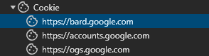

###For education purpose###

Cre: https://github.com/dsdanielpark/Bard-API

Tài liệu tham khảo: https://github.com/dsdanielpark/Bard-API/blob/main/documents/README_DEV.md

My info: https://github.com/Sanaee1

Discord: https://discordapp.com/users/688997978391969873

======Cách tra cứu giá trị "__Secure-1PSID_TOKEN" và "__Secure-1PSIDTS_TOKEN" ========
1. Vào bard.google.com 
2. Trên bàn phím nhấn F12 để vào chế độ kiểm tra thành phần
3. Vào Ứng dụng (Application) rồi vào phần Cookie
    
        

   

5. Tìm các giá trị của "__Secure-1PSID" và "__Secure-1PSIDTS" và dán giá trị tương ứng vào trong file .env
==============================================================================

===============HOW TO USE=====================
1. Cài đặt thư viện
pip install -r requirement.txt để tải về các thư viện cần thiết
2. Nhập vào các giá trị cho "__Secure-1PSID_TOKEN" và "__Secure-1PSIDTS_TOKEN" trong file .env
3. Chạy file main.py
